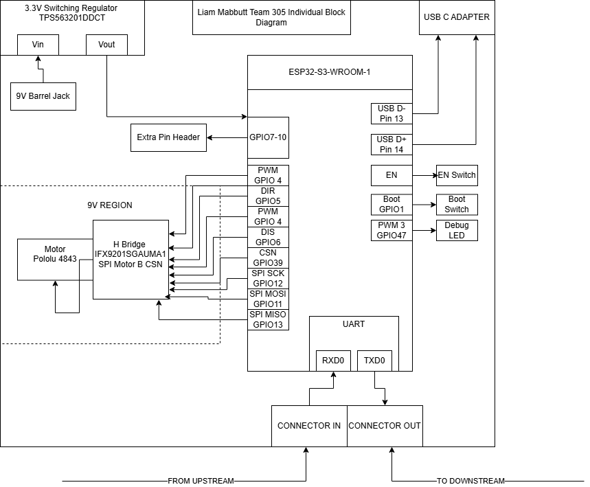

## Drive Train Control Subsystem Overview

The drivetrain subsystem is responsible for controlling the movement of the rover through a single motor drive channel. Power is supplied via a 9V barrel jack which feeds both the TPS563201DDCT switching regulator, producing a regulated 3.3V supply for the ESP32-S3-WROOM-1 microcontroller, and the 9V motor power region which directly drives the H-bridge.

The ESP32-S3-WROOM-1 serves as the central controller, receiving motor speed and direction commands from upstream nodes via a UART bus through the connector in port. The microcontroller processes these commands and outputs control signals to the IFX9201SGAUMA1 H-bridge motor driver, including a 20kHz PWM signal on GPIO4 for speed control, a direction signal on GPIO5, a disable signal on GPIO6, and SPI communication on GPIO11, GPIO12, GPIO13 and GPIO39 for diagnostic feedback and fault monitoring. The H-bridge drives the Pololu 4843 DC gearmotor, with motor current sourced directly from the 9V supply rail.

Processed UART messages are forwarded downstream to the next node via the connector out port, maintaining the team's daisy-chain bus architecture. Additional features include a USB-C programming interface connected directly to the ESP32 via GPIO13 and GPIO14, hardware reset and boot mode switches on the EN and GPIO1 pins respectively, a debug LED on GPIO47, and an auxiliary pin header on GPIO7 through GPIO10 for development and testing purposes.

## Block Diagram 
Here is the block diagram for my substystem.

## Decision-Making Process and Requirements Alignment

### Microcontroller Power Regulation
The requirement calls for a stable 3.2V minimum supply with a target of regulated 3.3V. The TPS563201DDCT switching regulator was selected specifically to meet this as it produces a precise regulated 3.3V output from the 9V barrel jack supply using a feedback resistor divider tuned to 3.3V. This is a more robust solution than a linear regulator since it maintains tight voltage regulation under varying load conditions as the ESP32 draws varying current during WiFi and processing activity.

### Microcontroller Selection
The requirement specifies a PIC or ESP-class MCU with a target of ESP32 specifically. The ESP32-S3-WROOM-1 was selected as it directly meets the target requirement, providing sufficient GPIO for all motor control signals, SPI, UART, USB programming, and debug peripherals simultaneously without any pin conflicts.

### Motor Configuration Support
The requirement threshold is 2WD with a stretch goal of 4WD expandability. The current design drives one motor via the IFX9201SG H-bridge, representing one wheel of a differential drive system. The architecture is intentionally designed to be expandable. The team's daisy-chain UART bus means additional motor driver nodes can be added inline without modifying existing nodes, directly supporting the 4WD stretch goal at the system level.

### Motor Type Compatibility
The requirement specifies brushed DC motors with a target of high-efficiency DC gear motors. The Pololu 4843 is a brushed DC gearmotor that directly satisfies both the threshold and target requirements. The gear reduction provides the torque characteristics needed for rover mobility while the brushed DC interface is fully compatible with the H-bridge driver.

### Motor Driver Requirement
The requirement calls for an external motor driver IC with a target of an integrated driver with protection. The IFX9201SGAUMA1 was selected specifically because it exceeds the target as it provides hardware overcurrent protection via chopper current limitation, thermal shutdown, short circuit detection on both output pins, undervoltage lockout, and open load detection. All of these protections are hardware-based and operate independently of the microcontroller.

### Motor Speed Control
The requirement threshold is open-loop PWM control with a target of closed-loop speed control. The current implementation uses 20kHz PWM on GPIO4 for speed control which meets the threshold requirement. The Pololu 4843 includes a quadrature encoder and wiring for ENC_A, ENC_B, ENC_VCC and ENC_GND is present in the design, meaning closed-loop PID speed control can be implemented in firmware to meet the target requirement without any hardware changes.

### Steering Control Method
The requirement threshold is differential steering with a stretch goal of independent wheel steering. The design uses a single H-bridge driving one motor, which as part of the team's overall system achieves differential steering by independently controlling left and right wheel speeds across separate nodes. The UART bus architecture allows the HMI node to send independent speed commands to each motor node, directly enabling differential steering.

### Motor Feedback Sensing
The requirement calls for at least one feedback signal with a target of both current and speed feedback. The design addresses both as the IFX9201SG provides current sense feedback via the SO pin over SPI, reporting overcurrent and current limitation status through the diagnosis register. Speed feedback is available through the Pololu 4843 encoder connected to interrupt-capable GPIO pins. Both feedback paths are present in the hardware design.

### Safety Interlock Implementation
The requirement threshold is software-based motor disable with a target of hardware and software interlocks. The design meets both. The DIS pin on GPIO6 provides a hardware interlock that disables all H-bridge outputs instantly regardless of software state and this is a direct hardware signal requiring no firmware execution. The SPI control register's SEN bit provides the software interlock layer. Additionally the IFX9201SG's built-in protection functions act as a third independent hardware safety layer.

### Communication with Main Controller
The requirement calls for digital control signals with a target of a fully synchronised control interface. The UART daisy-chain bus receives structured 64-byte packets from the upstream HMI node containing motor speed commands, stop commands, and acknowledgement messages. The protocol includes packet validation, sender verification, ACK responses, and packet forwarding. This represents a fully synchronised control interface that exceeds the digital control signal threshold requirement.