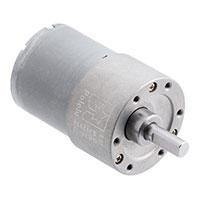

## Module's Selected Major Components

The following sections are the selected major components necessary for  .....

>**For each of the following sections, use <ins>one of the two styles</ins> given near the end. *REMOVE THIS NOTE***

### Power Management

(**remove this note/placeholder**: this is where your 3.3 volt switching regulator, any other needed power regulator, and power source {if applicable} **THAT WERE SELECTED**)

For more details, review the ["Appendix - Component Selection Process - Power Mangement"](https://embedded-systems-design.github.io/EGR314DataSheetTemplate/Appendix/01-Componet-Selection/Component-Selection-Process/#power-management) selection.

 ## Pololu #4741: 19:1 Metal Gearmotor 37Dx52L mm 12V 
 
 
 [link to product](https://www.digikey.com/en/products/detail/pololu/4741/10450198)

| Pros | Cons |
|------|------|
| High stall torque (~8.5 kg·cm at 12V) provides excellent climbing ability and margin for heavier loads or rough terrain (e.g., gravel, small inclines). | Larger and heavier (~200–250g each estimated for 37D series) than 25D or micro motors, making the rover bulkier and harder to keep "small/lightweight". |
| Helical first-stage gears reduce noise and improve efficiency/smoothness compared to pure spur designs. | Higher stall current (~5.5A) demands a robust H-bridge/driver (e.g., not marginal with basic dual-channel ICs like DRV8833 at peaks). |
| Larger 6mm D-shaft and robust 37mm-diameter build offer superior durability and easier wheel mounting for student projects. | Lower no-load speed (~530 RPM) results in slower top speed with typical wheels (e.g., ~1.5–2 m/s), which may feel sluggish for flat exploration unless PWM-boosted. |

## Pololu #4843: 20.4:1 Metal Gearmotor 25Dx65L mm HP 12V with 48 CPR Encoder

[link to product](https://www.digikey.com/en/products/detail/pololu/4843/10450245?s=N4IgTCBcDaIAoHsA2BXVACALADkwZhAF0BfIA)

| Pros | Cons |
|------|------|
| Balanced performance: 7.4 kg·cm stall torque + 500 RPM no-load gives good mix of power for obstacles and decent speed for covering ground quickly. | High stall current (~5A) requires careful driver selection and power supply design to handle peaks without voltage sag or overheating. |
| Integrated high-resolution encoder (48 CPR motor → ~980 CPR output) simplifies odometry/PID control without extra components. | Slightly longer body (65 mm) and 98g weight per motor add up in a compact rover chassis compared to micro options. |
| Compact 25mm diameter cylindrical form factor fits well in small-to-mid rover designs; metal gears ensure longevity. | Torque is solid but lower than larger 37D motors, so less headroom on very steep slopes or with added payload (e.g., sensors/arm). |

 ## Pololu #5223: 250:1 Micro Metal Gearmotor HPCB 12V with 12 CPR Encoder, Side Connector
 
  
 [link to product](https://www.digikey.com/en/products/detail/pololu/5223/22601737?s=N4IgTCBcDaIA4HsA2BXVACArGMBmEAugL5A)

| Pros | Cons |
|------|------|
| Extremely compact (10×12 mm gearbox cross-section, lightweight ~20–30g) ideal for truly miniature/small rovers with tight space/weight constraints. | Very high gear reduction leads to low no-load speed (~130 RPM), resulting in slow rover movement (e.g., <0.5 m/s with small wheels) — may not suit faster exploration tasks. |
| High stall torque relative to size (~3.0 kg·cm) sufficient for light rovers on flat/moderate terrain with good wheel leverage. | Lower absolute torque limits capability on rougher terrain, steeper inclines, or if rover mass exceeds ~2–3 kg total. |
| Integrated encoder (12 CPR) + HPCB (high-power carbon brush) motor provides reliable feedback and efficiency in a tiny package; side connector eases wiring in small chassis. | Smaller 3mm D-shaft and micro construction may have more backlash or wear under heavy/continuous use compared to larger metal gearmotors. |

### Actuator

(**remove this note/placeholder**: if applicable, this is where your **Selected** the actuator items go, which includes both the driver and motor. Otherwise, remove this section.)

For more details, review the ["Appendix - Component Selection Process - Actuator"](https://embedded-systems-design.github.io/EGR314DataSheetTemplate/Appendix/01-Componet-Selection/Component-Selection-Process/#actuator) selection.

-----------
> Remove the following before submitting! Use them to present the selected components

### Style 1

> This is the example found in the assignment, uses more html

*Table 1: Example component selection*

**External Clock Module**

| **Component**                                                                                                                                                                                      | **Pros**                                                                                                                                    | **Cons**                                                                                            |
| ------------------------------------------------------------------------------------------------------------------------------------------------------------------------------------------------- | ------------------------------------------------------------------------------------------------------------------------------------------- | --------------------------------------------------------------------------------------------------- |
|   XC1259TR-ND surface mount crystal $1/each [link to product](http://www.digikey.com/product-detail/en/ECS-40.3-S-5PX-TR/XC1259TR-ND/827366)                 | \* Inexpensive[^1] \* Compatible with PSoC \* Meets surface mount constraint of project                                               | \* Requires external components and support circuitry for interface \* Needs special PCB layout. |

**Rationale:** A clock oscillator is easier ....

### Style 2

> Also acceptable, more markdown friendly

**External Clock Module**

1. XC1259TR-ND surface mount crystal

    

    * $1/each
    * [link to product](http://www.digikey.com/product-detail/en/ECS-40.3-S-5PX-TR/XC1259TR-ND/827366)

    | Pros                                      | Cons                                                             |
    | ----------------------------------------- | ---------------------------------------------------------------- |
    | Inexpensive                               | Requires external components and support circuitry for interface |
    | Compatible with PSoC                      | Needs special PCB layout.                                        |
    | Meets surface mount constraint of project |

**Rationale:** A clock oscillator is easier ...
