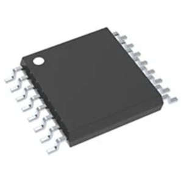

## Drive Train Module's Selected Major Components

The following sections are the selected major components necessary for the drive train subsystem of my teams project.

 ### Pololu 4741: 19:1 Metal Gearmotor 37Dx52L mm 12V 
 
 
 
 [link to product](https://www.digikey.com/en/products/detail/pololu/4741/10450198)

| Pros | Cons |
|------|------|
| High stall torque (~8.5 kg·cm at 12V) provides excellent climbing ability and margin for heavier loads or rough terrain (e.g., gravel, small inclines). | Larger and heavier (~200–250g each estimated for 37D series) than 25D or micro motors, making the rover bulkier and harder to keep "small/lightweight". |
| Helical first-stage gears reduce noise and improve efficiency/smoothness compared to pure spur designs. | Higher stall current (~5.5A) demands a robust H-bridge/driver (e.g., not marginal with basic dual-channel ICs like DRV8833 at peaks). |
| Larger 6mm D-shaft and robust 37mm-diameter build offer superior durability and easier wheel mounting for student projects. | Lower no-load speed (~530 RPM) results in slower top speed with typical wheels (e.g., ~1.5–2 m/s), which may feel sluggish for flat exploration unless PWM-boosted. |

### Pololu 4843: 20.4:1 Metal Gearmotor 25Dx65L mm HP 12V with 48 CPR Encoder

[link to product](https://www.digikey.com/en/products/detail/pololu/4843/10450245?s=N4IgTCBcDaIAoHsA2BXVACALADkwZhAF0BfIA)

| Pros | Cons |
|------|------|
| Balanced performance: 7.4 kg·cm stall torque + 500 RPM no-load gives good mix of power for obstacles and decent speed for covering ground quickly. | High stall current (~5A) requires careful driver selection and power supply design to handle peaks without voltage sag or overheating. |
| Integrated high-resolution encoder (48 CPR motor → ~980 CPR output) simplifies odometry/PID control without extra components. | Slightly longer body (65 mm) and 98g weight per motor add up in a compact rover chassis compared to micro options. |
| Compact 25mm diameter cylindrical form factor fits well in small-to-mid rover designs; metal gears ensure longevity. | Torque is solid but lower than larger 37D motors, so less headroom on very steep slopes or with added payload (e.g., sensors/arm). |

 ### Pololu 5223: 250:1 Micro Metal Gearmotor HPCB 12V with 12 CPR Encoder, Side Connector
 
 
  
 [link to product](https://www.digikey.com/en/products/detail/pololu/5223/22601737?s=N4IgTCBcDaIA4HsA2BXVACArGMBmEAugL5A)

| Pros | Cons |
|------|------|
| Extremely compact (10×12 mm gearbox cross-section, lightweight ~20–30g) ideal for truly miniature/small rovers with tight space/weight constraints. | Very high gear reduction leads to low no-load speed (~130 RPM), resulting in slow rover movement (e.g., <0.5 m/s with small wheels) — may not suit faster exploration tasks. |
| High stall torque relative to size (~3.0 kg·cm) sufficient for light rovers on flat/moderate terrain with good wheel leverage. | Lower absolute torque limits capability on rougher terrain, steeper inclines, or if rover mass exceeds ~2–3 kg total. |
| Integrated encoder (12 CPR) + HPCB (high-power carbon brush) motor provides reliable feedback and efficiency in a tiny package; side connector eases wiring in small chassis. | Smaller 3mm D-shaft and micro construction may have more backlash or wear under heavy/continuous use compared to larger metal gearmotors. |

### Optimal Motor Selection: Pololu #4843 (20.4:1 Metal Gearmotor 25Dx65L mm HP 12V with 48 CPR Encoder)
The Pololu #4843 is the optimal choice for the small exploration rover's drive train after comparing it to the #4741 (18.75:1 37D series) and #5223 (250:1 micro HPCB series). It delivers a strong balance of 7.4 kg·cm stall torque and 500 RPM no-load speed at 12 V, enabling reliable performance on moderate terrain (e.g., 15° inclines, light gravel) with practical speeds (~1.5–2.5 m/s using 80–120 mm wheels) and ample margin for a ~2–5 kg rover—outperforming the slower #5223 and avoiding the excessive bulk of the larger #4741. Its integrated 48 CPR encoder (yielding ~980 CPR at output) provides precise odometry and closed-loop control without added components, directly supporting project feedback needs. The compact 25 mm × 65 mm size and ~98 g weight per motor fit a small chassis perfectly, while full metal gears ensure durability and longevity under student testing conditions. Operating efficiently on common 3S LiPo batteries with manageable current draw, and backed by Pololu's excellent documentation and ecosystem, it minimizes risks and integration effort—making it the best overall fit for capability, compactness, reliability, and project practicality compared to the alternatives.

### Texas Instruments DRV8873 (e.g., DRV8873SPWPR or similar variant; HTSSOP-24 SMD package)
 
 
 
 [link to product](https://www.digikey.com/en/products/detail/texas-instruments/DRV8833PWR/4251166)

| Pros | Cons |
|------|------|
| High current capability (up to 10 A peak, integrated current sensing) handles the 5 A stall comfortably with headroom for spikes during direction changes or loads. | Slightly higher cost compared to basic drivers; may require good PCB thermal design/heatsinking for sustained high-current operation. |
| Wide voltage range (4.5–38 V) and excellent built-in protections (overcurrent, thermal shutdown, undervoltage lockout, fault reporting) reduce damage risk in student rover testing. | Larger package footprint than ultra-compact options, though still SMD-friendly for custom PCBs. |
| Integrated features like current-sense output simplify monitoring stall/overload in firmware; popular TI part with good datasheets and examples. | May need external components (e.g., sense resistor) for full current feedback if desired. |

### Infineon IFX9201SG (DSO-12 SMD package)

 
 
 [link to product](https://www.digikey.com/en/products/detail/infineon-technologies/IFX9201SGAUMA1/5415542)

| Pros | Cons |
|------|------|
| Robust 6 A continuous rating (with low RDS(on)) easily manages 5 A stalls; automotive-grade reliability for durable rover use on varied terrain. | Single half-bridge design means two ICs needed for a full H-bridge (or dual setup for 2 motors), increasing component count and PCB space slightly. |
| Wide 5–36 V range, integrated protections (overtemperature, short-circuit, UVLO, current limiting), and SPI diagnostics or simple error flag for easy debugging. | Higher unit cost; less common in hobby/student examples compared to TI parts, though well-documented. |
| Compact, small SMD package with few external components needed; efficient for battery-powered rovers. | Requires careful gate drive/logic interfacing (3.3–5 V compatible but check levels). |

### Texas Instruments DRV8962 (e.g., DRV8962DDWR; HTSSOP-28 SMD package)

 
 
 [link to product](https://www.digikey.com/en/products/detail/texas-instruments/DRV8962DDWR/18724317)

| Pros | Cons |
|------|------|
| Strong 5 A continuous / 8 A peak rating provides excellent margin for the motor's 5 A stall and dynamic loads; wide 4.5–65 V support. | Larger package and potentially higher power dissipation under heavy load (needs good PCB layout/thermal vias). |
| Full H-bridge (or configurable) with integrated protections (overcurrent, thermal, undervoltage) and PWM compatibility; suitable for brushed DC in rover differential drive. | May be overkill (higher voltage range) for a strict 12 V setup, adding minor cost/complexity. |
| Good availability on DigiKey, detailed TI datasheets, and features like fault monitoring for reliable student projects. | Slightly more pins/complexity in layout compared to simpler dual-channel alternatives. |

### Optimal H-Bridge Selection: Infineon IFX9201SG (DSO-12 SMD Package)
The Infineon IFX9201SG is selected as the optimal H-bridge driver for the Pololu #4843 motor (12 V nominal, 5 A stall current) in the small exploration rover's drive train subsystem. It offers a robust 6 A continuous current rating, providing comfortable headroom and reliable handling of the motor's 5 A stall peaks during startups, direction changes, or terrain obstacles—avoiding the thermal risks or current limiting issues common with lower-rated drivers like the DRV8833. Its wide 4.5–36 V operating range perfectly matches 12 V battery supplies, while integrated protections (overtemperature, short-circuit, undervoltage lockout, and current limiting) enhance safety and reduce failure risks in prototyping. The compact DSO-12 SMD package complies with EGR 314 surface-mount requirements for custom PCBs, requires minimal external components, and supports PWM/DIR control with 3.3 V/5 V logic compatibility for easy MCU integration. Backed by Infineon's automotive-grade reliability, detailed datasheets, and low standby current for battery efficiency, it outperforms simpler alternatives in durability and margin for the rover's moderate loads, making it a strong, dependable choice for reliable bidirectional motor control.

### My Role on the Team, Actuation Subsystem Responsibilities, and Microcontroller Selection
As the Actuation Subsystem member for our small exploration rover group project, I focus on the design, selection, integration, and control of the rover's motion and drive capabilities, centered around the two Pololu #4843 motors and the Infineon IFX9201SG H-bridge drivers, with the ESP32-S3-WROOM-1-N4 microcontroller providing the PWM signals, control logic, and communication functionality. My primary responsibilities include selecting and justifying the motors (Pololu #4843 for their balanced 7.4 kg·cm stall torque, 500 RPM no-load speed, integrated 48 CPR encoders, and compact metal-gear construction suited to a ~2–5 kg rover on moderate terrain) and the H-bridge (IFX9201SG for its robust 6 A continuous rating, wide 4.5–36 V range, integrated protections against overcurrent/thermal/short-circuit, and compact DSO-12 SMD package compliant with EGR 314 surface-mount requirements). I handle the actuation block in the system diagram, ensuring reliable bidirectional PWM control for differential drive, precise speed and direction commands from the ESP32-S3's MCPWM peripheral, and closed-loop feedback using the motor encoders to achieve accurate odometry and smooth navigation. This includes verifying current handling for the motor's ~5 A stall peaks, designing appropriate power routing and protection, and collaborating on firmware interfaces for torque/speed limiting to prevent damage during testing or obstacle encounters. By designing the actuation subsystem end-to-end—from component tables and rationale to wiring, PCB integration considerations, and basic control tuning—I ensure the rover can move reliably, responsively, and efficiently across the intended exploration environments while meeting all assignment specifications for off-the-shelf solutions, documentation, and reliability.
