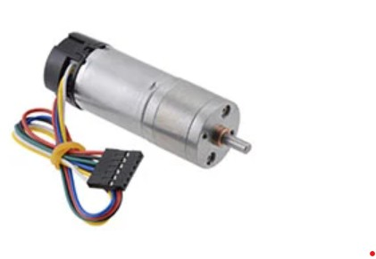
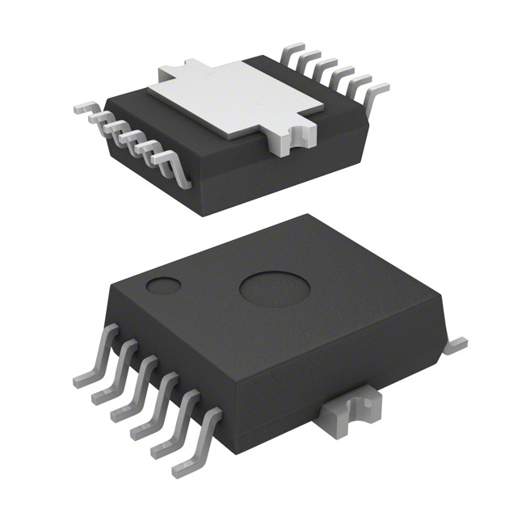

# Drive Train Module: Updated Component Selection

## Overview

This page documents the final component selections for the Drive Train subsystem of the Team 305 small exploration rover. Selections have been updated from the initial submission to reflect decisions made during PCB design, firmware development, and integration with the team's UART communication bus. Key changes include the finalisation of the motor selection at 9V operation (revised from the initial 12V nominal assumption), confirmation of the IFX9201SG H-bridge with full SPI diagnostic integration, and the addition of the TPS563201DDCT switching regulator as a dedicated power regulation component.

---

## Final Major Components Summary Table

| Component | Part Number | Function | Supplier |
|---|---|---|---|
| Microcontroller Module | ESP32-S3-WROOM-1-N4 | Central controller (PWM, SPI, UART, USB) | DigiKey |
| H-Bridge Motor Driver | IFX9201SGAUMA1 | Bidirectional motor control with SPI diagnostics | DigiKey |
| DC Gearmotor with Encoder | Pololu 4843 | Drive wheel actuation and speed feedback | DigiKey |
| Switching Voltage Regulator | TPS563201DDCT | 9V to 3.3V regulation for ESP32 | DigiKey |
| USB-C Receptacle | GCT USB4085-GF-A | Firmware programming interface | DigiKey |
| Barrel Jack Connector | Würth 694106301002 | 9V power input | DigiKey |
| Resettable Fuse | Bourns MF-MSMF300/12 | Overcurrent protection on 9V input rail | DigiKey |

---

## Component Selection Rationale

### Pololu 4843: 20.4:1 Metal Gearmotor 25Dx65L mm HP 12V with 48 CPR Encoder

[Link to product](https://www.digikey.com/en/products/detail/pololu/4843/10450245)

| Pros | Cons |
|---|---|
| Balanced performance: 7.4 kg·cm stall torque and 500 RPM no-load speed gives good mix of power and speed for moderate terrain | High stall current (~5A at 12V, ~3.75A at 9V) requires careful driver and power supply design |
| Integrated high-resolution encoder (48 CPR motor, approximately 980 CPR output) enables closed-loop PID control without extra components | Slightly longer body (65mm) and 98g per motor adds up in a compact chassis |
| Compact 25mm diameter cylindrical form factor fits small-to-mid rover designs; metal gears ensure longevity | Lower torque headroom than larger 37D motors on very steep slopes or with heavy payload |

**Decision update:** The motor is operated at **9V** rather than the nominal 12V following integration with the team's 9V power architecture. At 9V the motor delivers approximately 75% of rated speed and reduced stall current (~3.75A), which fits more comfortably within the IFX9201SG's 6A continuous rating and reduces thermal stress on the H-bridge. This trade-off was accepted as the reduced speed remains adequate for the rover's intended exploration tasks, and the lower current draw improves battery life and overall system stability.

**How it meets requirements:** The Pololu 4843 directly satisfies the motor type compatibility requirement for high-efficiency DC gear motors, and its integrated encoder enables the closed-loop speed control target requirement. The 7.4 kg·cm stall torque provides sufficient margin for the rover's estimated 2 to 5 kg mass on moderate terrain including small inclines and light gravel.

---

### Infineon IFX9201SGAUMA1: 6A H-Bridge with SPI (PG-DSO-12-17 Package)

[Link to product](https://www.digikey.com/en/products/detail/infineon-technologies/IFX9201SGAUMA1/5415542)

| Pros | Cons |
|---|---|
| Robust 6A continuous rating provides comfortable headroom over the motor's 3.75A operating current at 9V | Requires VSO pin connected to 3.3V to power the SPI output buffer. Omitting this disables SPI readback |
| Full SPI diagnostic register provides fault reporting including overcurrent, overtemperature, short circuit to GND/VS, and undervoltage | CSN pin has an internal pullup. If left floating the IC enters SPI mode and ignores PWM/DIR inputs |
| Hardware protections operate independently of firmware. Chopper current limiting, thermal shutdown, and short circuit latch all function without MCU involvement | Heat slug must be soldered to GND plane for both electrical and thermal operation. A floating heat slug prevents correct IC operation |
| PWM/DIR control mode reduces GPIO requirements; SPI mode adds full diagnostic capability | Single H-bridge per IC, so one IC per motor is required |

**Decision update:** During hardware bring-up it was discovered that the CSN pin must be driven high by the ESP32 at startup to place the IC in PWM/DIR mode, and that VSO must be connected to 3.3V to enable SPI readback. These were not implemented in the initial schematic and have been corrected in the final PCB design. Full SPI communication is now implemented in firmware using the IFX9201SG's 8-bit register interface, providing real-time fault monitoring via the diagnosis register.

**How it meets requirements:** The IFX9201SG satisfies the motor driver requirement for an integrated driver with protection, exceeding the threshold by providing both hardware and software interlock capability. The DIS pin provides a hardware disable path meeting the safety interlock requirement, and the SPI diagnosis register provides current and fault feedback meeting the motor feedback sensing requirement.

---

### Texas Instruments TPS563201DDCT: 3A Synchronous Step-Down Converter (SOT-23-6)

| Pros | Cons |
|---|---|
| Regulated 3.3V output from 9V input with up to 90%+ efficiency, which is far superior to a linear regulator | Fixed 500kHz switching frequency requires careful PCB layout to minimise switching noise |
| D-CAP2 control mode requires no external compensation components, which simplifies design | Feedback resistor divider must use 1% tolerance resistors for accurate output voltage |
| Up to 3A output current, well above the ESP32's maximum draw | VBST cap placement is critical and must be adjacent to the IC for correct high-side gate drive |
| Internal soft-start, UVLO, overcurrent, and thermal protection | SOT-23-6 package is small and requires care during hand soldering |

**Decision update:** The TPS563201DDCT was selected over a linear regulator specifically for efficiency. A linear regulator dropping 9V to 3.3V would dissipate 5.7V x load current as heat. At 500mA ESP32 load this is 2.85W of wasted power. The switching regulator wastes less than 10% of this, significantly extending battery life in a rover application. Output voltage is set to 3.3V using a 390kΩ/120kΩ feedback divider network verified against the 0.765V internal reference.

**How it meets requirements:** The TPS563201DDCT directly satisfies the microcontroller power regulation requirement, providing a regulated 3.3V supply meeting the target measure. The switching topology ensures stable voltage regulation under varying ESP32 load conditions including WiFi and GPIO switching transients.

---

### ESP32-S3-WROOM-1-N4: Microcontroller Module

| Pros | Cons |
|---|---|
| Native USB Serial/JTAG on GPIO19/GPIO20 means no external USB-UART chip is required for programming | N4 variant has no PSRAM, providing 512KB SRAM only, which is sufficient for this application |
| Dual SPI peripherals, multiple UART interfaces, and LEDC PWM peripheral support all required signals simultaneously | Antenna area must be kept clear of copper pour on PCB |
| 3.3V logic compatible with IFX9201SG inputs directly, so no level shifting is required | Boot strapping pins (GPIO0, GPIO3, GPIO45, GPIO46) must be avoided for general use |
| Sufficient GPIO for full motor control, SPI, UART, USB, encoder inputs, and debug LED with pins remaining for expansion header | |

**How it meets requirements:** The ESP32-S3 directly satisfies the microcontroller selection requirement. Its LEDC PWM peripheral generates the 20kHz motor control signal with hardware precision, and its UART peripheral supports the team's daisy-chain communication bus meeting the fully synchronised control interface target requirement.

---

## ESP32-S3-WROOM-1-N4 Pinout Table

| GPIO | Pin | Function | Connected To | Direction |
|---|---|---|---|---|
| GPIO4 | 5 | Motor B PWM | IFX9201SG-B PWM (pin 12) | Output |
| GPIO5 | 6 | Motor B DIR | IFX9201SG-B DIR (pin 1) | Output |
| GPIO6 | 7 | Motor B DIS | IFX9201SG-B DIS (pin 11) | Output |
| GPIO7 | 8 | Expansion Header | Pin Header | I/O |
| GPIO8 | 9 | Expansion Header | Pin Header | I/O |
| GPIO9 | 10 | Expansion Header | Pin Header | I/O |
| GPIO10 | 11 | Expansion Header | Pin Header | I/O |
| GPIO11 | 12 | SPI MOSI | IFX9201SG-B SI (pin 8) | Output |
| GPIO12 | 13 | SPI SCK | IFX9201SG-B SCK (pin 10) | Output |
| GPIO13 | 14 | SPI MISO | IFX9201SG-B SO (pin 3) | Input |
| GPIO17 | 18 | Encoder A, Motor B | Pololu 4843 ENC_A | Input |
| GPIO18 | 19 | Encoder B, Motor B | Pololu 4843 ENC_B | Input |
| GPIO19 | 20 | USB D- | USB-C Connector A7/B7 | I/O |
| GPIO20 | 21 | USB D+ | USB-C Connector A6/B6 | I/O |
| GPIO39 | 40 | SPI CSN, Motor B | IFX9201SG-B CSN (pin 9) | Output |
| GPIO43 | 44 | UART TX | UART Connector OUT | Output |
| GPIO44 | 45 | UART RX | UART Connector IN | Input |
| GPIO47 | 48 | Debug LED | 330Ω resistor to LED to GND | Output |
| GPIO48 | 49 | Onboard RGB LED | Module internal | Output |
| EN | N/A | Reset | 10kΩ pullup + 100nF + Reset button | Input |
| GPIO0 | 1 | Boot Mode | 10kΩ pullup + Boot button | Input |

---

## Decision-Making Process

The component selection process was driven by three primary constraints: compatibility with the team's 9V power architecture, compliance with EGR314 surface-mount PCB requirements, and integration with the team's UART daisy-chain communication protocol.

The Pololu 4843 was retained from the initial selection as it remains the best balance of torque, speed, compactness and encoder resolution for the rover's expected operating conditions. Operating it at 9V rather than 12V was a deliberate trade-off accepted after calculating that the resulting 3.75A stall current fits safely within the IFX9201SG's 6A rating, and that the ~75% speed reduction still provides adequate rover mobility.

The IFX9201SG was confirmed as the optimal H-bridge after evaluating the DRV8873 and DRV8962 alternatives. The SPI diagnostic interface was a decisive factor, as it provides real-time fault visibility that the simpler PWM-only drivers cannot match, and this directly supports the motor feedback sensing and safety interlock requirements. Hardware bring-up experience reinforced this decision, as the SPI diagnosis register proved invaluable for identifying and resolving wiring faults during testing.

The TPS563201DDCT was added as a formal component selection to address the power regulation requirement explicitly. Its switching topology was chosen over a linear regulator for efficiency reasons directly relevant to battery-powered rover operation.

The ESP32-S3-WROOM-1-N4 was confirmed over PIC alternatives due to its native USB programming capability eliminating the need for an external USB-UART chip, its 3.3V logic compatibility with all other ICs in the design, and its LEDC PWM peripheral providing hardware-accurate 20kHz motor control signals independent of firmware execution timing.