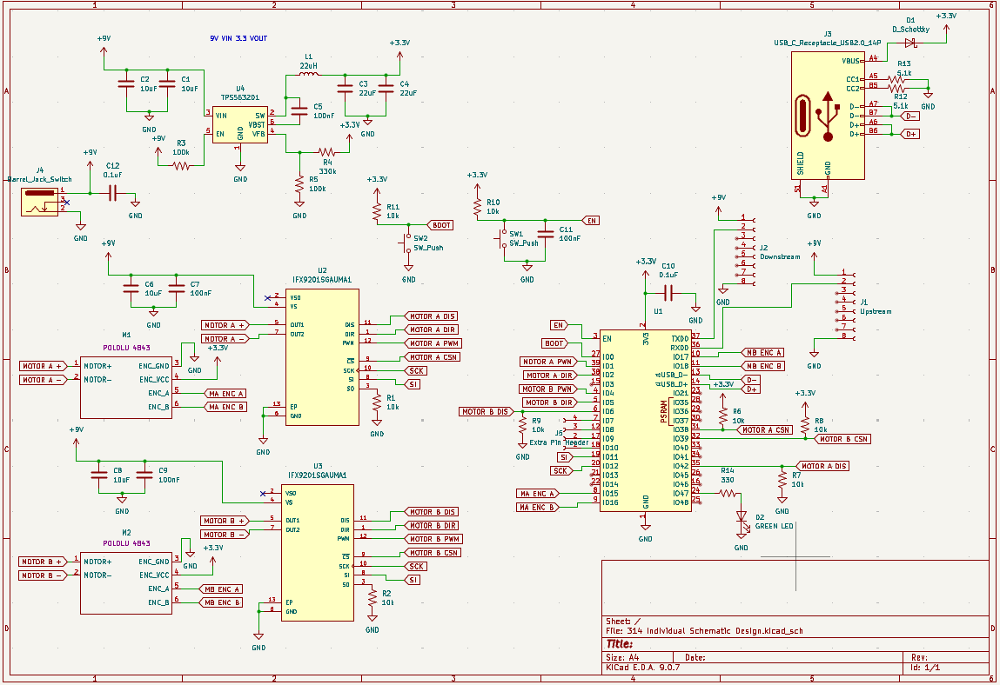

## Overview

Below is the schematic design for the drivetrain subsystem. Its consists of an ESP32 microcontroller, two h bridges for controlling the two motors, an extra pin header, a debug LED, and up/downstream UART connections.

{style width:"350" height:"300;"}
**Figure ##:** Showing a example schematic.

## Resouces

The schematic as a PDF download is available [*here*](Schematicpdf.pdf), and the Zip folder of the project [*here*](zip.zip).