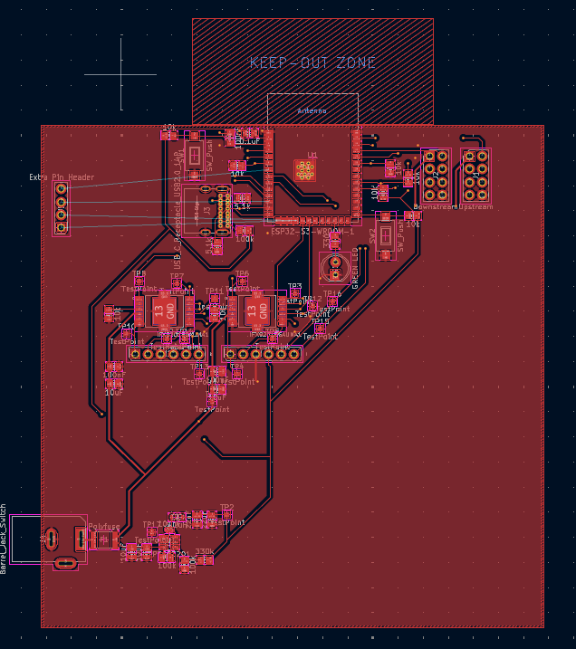
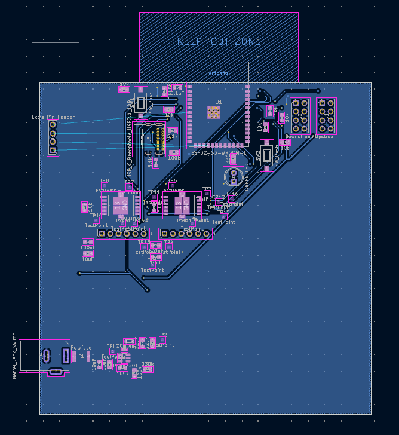
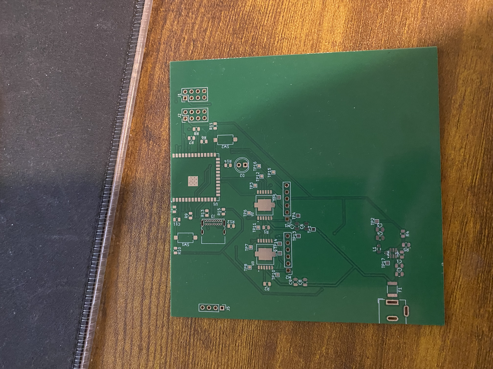
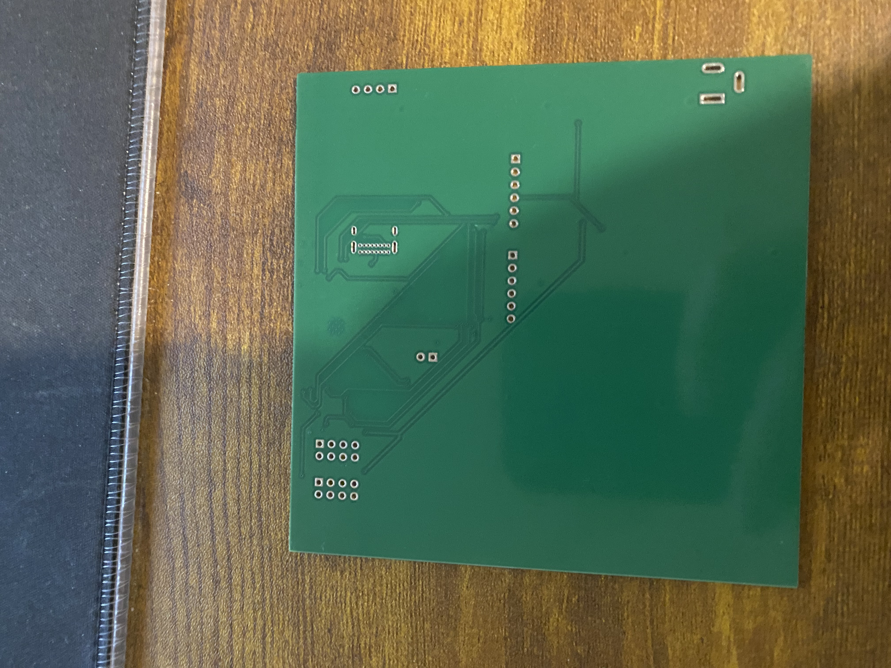
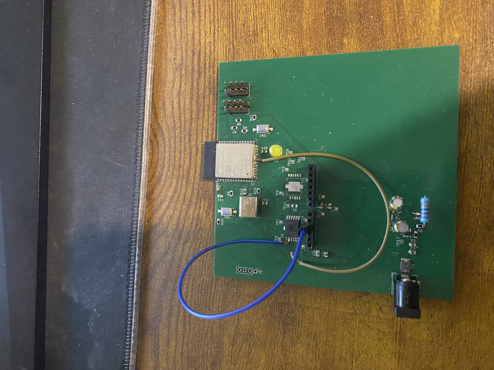

# PCB Design

## ECAD Design

### Front of PCB (ECAD)

### Back of PCB (ECAD)

---

## Physical PCB

### Raw PCB (Before Population)

---

### Finalized PCB (After Soldering and Testing)

#### Front

## Project Files

| File | Description | Download |
|---|---|---|
| ECAD Project | Full KiCad project files | [Download](Project.zip) |
| Gerber Files | Gerber files submitted for fabrication | [Download](GRB.zip) |

---

## Design Notes

### Known Issues and Revisions

List any issues discovered during testing and any changes made from the original design:

- Issue 1: 3.3V had to be jumped to pin 2 of the H-bridge to power the SPI communication BUS.
- Issue 2: SPI output had to be jumped to GPIO 13 of the EPS-32 instead of being pulled to ground via a 10k resistor.
- Issue 3: USB connector did not have enough clearance when mounted flush with the board and therefore had to be mounted at an angle so that the usb cable could be connnected.